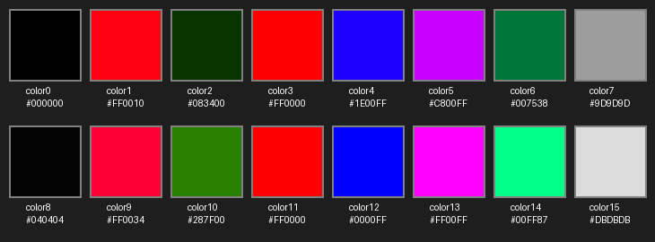
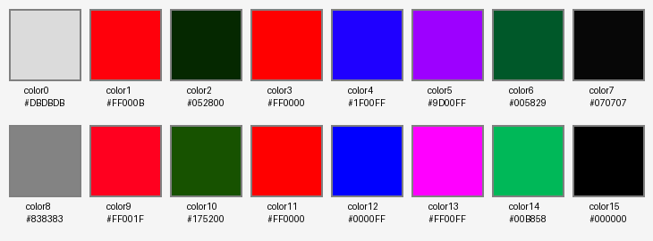

# palettgen

Generate perceptually uniform terminal color palettes from any brand color using the Okhsl color space.

## Features

- **Perceptually uniform**: Uses Okhsl color space for consistent visual appearance
- **Brand-aware**: Aligns palette hues to your brand color
- **Dark/Light mode**: Generate palettes for both modes
- **TOML output**: Compatible with omarchy theme system
- **Validated**: Checks contrast ratios and color distinctness

## Installation

```bash
python -m venv .venv
source .venv/bin/activate
pip install -e ".[dev]"
```

## Usage

```bash
# Generate everything: both dark + light TOMLs, palette images, and update README
python -m palettgen.cli --brand "#0052BB"

# Generate a single mode only
python -m palettgen.cli --brand "#0052BB" --mode dark --output colors.toml
python -m palettgen.cli --brand "#0052BB" --mode light --output colors-light.toml

# Show help
python -m palettgen.cli --help
```

## Arguments

- `--brand` (required): Brand color in hex format (e.g., #0052BB)
- `--mode`: Color mode - "dark" or "light". If omitted, generates both modes plus palette images and updates the README
- `--output`: Output file path for dark mode (default: colors.toml). Light mode is written to `<stem>-light.toml`
- `--images-dir`: Directory for palette PNG images (default: images, only used when `--mode` is omitted)

## Output Format

Generates a `colors.toml` file with 22 color keys: `accent`, `cursor`, `foreground`, `background`, `selection_foreground`, `selection_background`, and `color0`–`color15`.

## Palette

### Dark mode



### Light mode




## Testing

```bash
pytest tests/ -v
```

## Examples

```bash
# Robominds blue — generate everything (both modes, images, README)
python -m palettgen.cli --brand "#0052BB"

# GitHub purple
python -m palettgen.cli --brand "#6F42C1"

# VS Code blue
python -m palettgen.cli --brand "#007ACC"
```

## Limitations

- Validation threshold: Contrast ratio checked at 3.0:1 (practical minimum) rather than WCAG AA 4.5:1 due to Okhsl color space constraints
- Edge cases: Very dark or very light brand colors may produce limited palette variation

## License

MIT

## References

- [Oklab color space](https://bottosson.github.io/posts/oklab/)
- [Okhsl color model](https://bottosson.github.io/posts/colorpicker/)
- [Ham Vocke's terminal color scheme article](https://hamvocke.com/blog/lets-create-a-terminal-color-scheme/)
